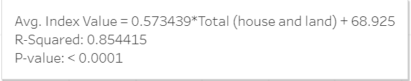

# Final-Project-Tableau

## Project/Goals
Analyse the trend of the housing market over time and compare the housing market in different states as well as different factors such as consumer price index and average income level.

## Process
- Loading Data Into Tableau
    - 4 CSVs
        - Consumer Index, Housing Price Index, Office Real Estate Index, Real Estate Numbers
    - 1 Excel
        - Real Estate Prices
    - 1 JSON
        - Weekly earnings
        - Created a script to combine column titles and data rows in Python

- Making sense of data
    - Convert dates into Date data types
    - Convert regions into City + States (Office + Real estate prices)
    - Merge many Excel sheet into one table
    - Understand which values are usable
        - For consumer index, two types of values: Percent and Index

- Creating Visualizations
- Finding Patterns
- Drawing conclusions

## Results
Tableau Public Link: https://public.tableau.com/app/profile/yuchen.he8057/viz/TableauProject_16921245913280/HousePriceDifferencevsEarningDifference?publish=yes
- Trend of house prices across Canada in the last 40 years

- Trend of house prices after 2005 with actual benchmark prices 

- Trend of house prices vs office prices

    - They are getting really close, but office prices are still higher
- Heatmap of Canada with current house prices for each available district

- Price difference between Montreal and Toronto

    - Montreal is still cheaper than Toronto, but the gap is closing
- Trend of house prices with monthly earnings

    - House prices are increasing faster than earnings
- Did people spend more of their earnings in 2014 than they did in 2001?

    - No, the percent of earnings spent decreased from 16% to 13% from 2001 to 2014
- Financial Crises

    - House prices dropped in 2008, but recovered quickly
    - Office prices dropped in 2008, but recovered slowly
    - Consumer index dropped in 2008, but recovered quickly
    - Earnings dropped in 2008, but recovered quickly
- Consumer Index vs House Prices

    - Consumer index is a good indicator of house prices, as the R-squared value is around 0.854, which means this trend is applicable to 85.4% of the data.
### Bonus
- House Price Difference vs Earning Difference

    - The difference between house prices and earnings is increasing, but dropped below 0 in 2008

## Challenges 
- Understanding datasets
- Combining data
- Manipulating Tableau

## Future Goals
- Look at the dataset beforehand
- Play around with dataset in Tableau to see the trends

